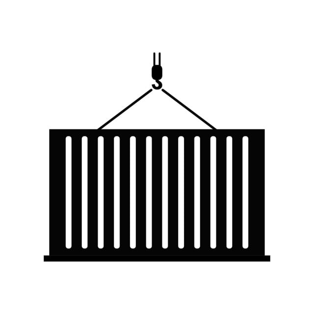

# IoC Container 📦

> Very simple IoC container for NodeJS

<p>
  

  

  
</p>

The intention behind this repository is to always maintain a viable and simple IoC to use in simple `Frameworks` like `Express`



## Installation

You can install the IoC using;

```bash
yarn add @SecJS/IoC
```

## Usage

> You can construct a new container from an array of service definitions

```js
import Container from '@SecJS/IoC'

const definitions = [
  {
    name: 'serviceA',
    factory: () => {
      return {
        foo: process.env.FOO,
      }
    },
  },
  {
    name: 'serviceF',
    factory: (serviceA) => {
      return `I am not a ${serviceA.foo}`;
    },
    dependencies: ['serviceA'],
    options: {
      scoped: true,
    }
  }
]

const services = Container.create(definitions);
```

> Each definition has a ```name```, ```factory```, ```dependencies``` and ```options```.

A Factory is a function/constructor that will receive dependencies as arguments. You can register new services at runtime, after container has been created.

```js
// Service Factory as a class name
class ServiceBConstructor {
  constructor(serviceA) {
    this.serviceA = service
  }

  doStuff() {}
}

// Service as a plain object
const serviceC = {}

// Scoped service (bound to a specific express request, e.g. session)
const serviceD = (serviceA) => {
  return {}
}

services.register('serviceB', ServiceBConstructor, ['serviceA'])
services.register('serviceC', () => serviceC)
services.register('serviceD', serviceD, ['serviceA', 'serviceC'], { scoped: true })
```

> Once you access a service by its name, it's turned into a singleton, and you get the same instance of the service on consecutive calls:

```js
const serviceA = services.get('serviceA');
// or
const { serviceB } = services;
```

> Express will be instantiated when you create a new container and injected as a service after being bound to a cls-hooked namespace, so be sure to use the same express instance, when registering middleware.

```js
// Some Middleware in some external module
export default (req, res, next) => {
  const services = req.app.get('services');

  services.serviceA.doStuff();

  next();
}
```

```js
// Your app booting module
import Container from '@SecJS/IoC';
import middleware from './some-external-module';

const services = Container.create();

const { express } = services;

express.use(middleware);
```
