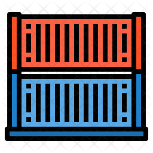

# IoC Container 📦

> Very simple IoC container for NodeJS

[](https://github.com/jlenon7?tab=followers)
[](https://github.com/secjs/ioc/stargazers/)

<p>
    <a href="https://www.buymeacoffee.com/secjs" target="_blank"></a>
</p>

<p>
  

  

  

  
</p>

The intention behind this repository is to always maintain a viable and simple IoC to use in any type of `NodeJS` applications, with or without `Frameworks`



## Installation

```bash
npm install @secjs/ioc
```

## Usage

### Set

> Container can register dependencies for you, every container.get will create a new instance for UserService.

```js
import { Container } from '@SecJS/IoC'
import { UserService } from 'app/Services/UserService'

const container = new Container()

container.set(UserService)
const userService = container.get<UserService>('UserService', 'props', 'to', 'UserService Constructor here')

console.log(userService.findAll())
```

### Singleton

> Container can register singleton dependencies, when singleton container.get will return the same UserService instance all time.

```js
import { Container } from '@SecJS/IoC'
import { UserService } from 'app/Services/UserService'

const container = new Container()

container.singleton(UserService, 'props', 'to', 'UserService Constructor here')
const userService = container.get<UserService>('UserService')

console.log(userService.findAll())
```

> Singleton can register static objects and arrays too, but for arrays and objects the name is required:

```js
container.singleton([], 'myArray')
container.singleton({}, 'myObject')

console.log(container.get('myArray')) // []
console.log(container.get('myObject')) // {}
```

---

## License

Made with 🖤 by [jlenon7](https://github.com/jlenon7) :wave:
